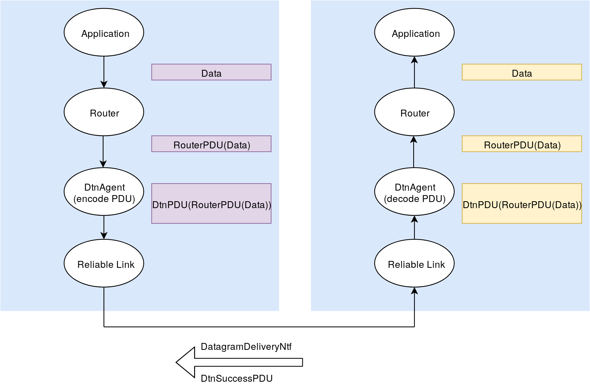

# Delay Tolerant Networks in UNETSTACK
## Design Document
*Arnav Dhamija, 2019*

**Everything in this DD is Work In Progress!**

**Code snippets are just for illustration and are a mix of Java/Groovy with pseudocode**

### Overview

Delay Tolerant Networks (DTNs) are used in a number of applications where conventional communication schemes are inadequate due to erratic network conditions, lack of network infrastructure, or long propagation delays in the communication medium.

In this project, we are attempting to use an adaptation of DTN protocols to improve message delivery in underwater networks using the UNETSTACK software platform. We are developing the protocol to target certain scenarios in which DTNs can have appreciable improvements in the network performance.

### Use Cases

* Robotic SWANs are used for collecting marine data through the use of on-board water probes. These SWANs have multiple network interfaces through which data can be transmitted. However, due to inclement weather conditions, it is also possible that no data gets transmitted at all. DTNs can save the day in this case by relaying critical information through nearby nodes which may have better network access. Thanks to the Store-Carry-And-Forward (SCAF) mechanism of DTNs, a SWAN can also wait until network conditions improve to send data.
* Underwater networks can consist of static sensors and an AUV for relaying the data from the sensor. Due to battery limitations, these sensors have constraints on the number of times they can transmit information to an AUV. A protocol which enables the sensor to only send data when it has detected an AUV relay is nearby can help in saving power. The Advertising feature characteristic of some ad-hoc DTNs can help here by having a Beacon broadcasting node information to other nodes over a low-power link.
* Maybe STARFISH swarm robots? DTNs could be used to help in disseminating information in swarms.

### Initial Goals

We are relaxing some of the requirements for DTNs for the first iteration of this project. Some of the current goals for the initial design include the implementation of:

* **Beacons**, to allow nodes to advertise their existence and find other nodes.
* A **Storage** mechanism to allow for SCAF. This should also delete files which have been successfully acknowledged or those which have expired TTLs.
* A **PDU** (which will be wrapped in the DatagramReq) for storing DTN metadata such as TTL.
* A **DtnAgent** which can handle Datagram requests from other agents and send essential notifications about the relay of PDUs. The DTNAgent should be able to talk over multiple ReliableLinks and should have a mechanism of choosing the best Link for a certain application.

Goals which will not be covered by the first iteration but which may be covered in the future are:

* Dedicated ACK schemes. Though this is very important in DTNs, we are only focussing on single hop routing and we only need to make sure our message has reached the next hop node. This will be covered by using ReliableLinks for single hops.
* Multihop routing of PDUs.
* Dynamic routing protocols.
* Fragmentation and reassembly of large PDUs.
* Multiple copies of PDUs.
* Optimally ordering/prioritizing PDUs for relays between nodes.

### Flowchart


### Classes

#### DtnBeacon

The Beacon is a part of the DTNAgent. Its task is to periodically send a message to advertise the existence of a node to all neighbors by sending a BeaconReq with the Recipient set to the DTNAgent. In response an Agent can send a Message with Performative AGREE if it is ready to start receiving files.

The BeaconReq should also some way of informing other nodes about which ReliableLinks are available on the node. Neighboring nodes can use this information to decide the best Link to send a DatagramReq on.

**Alternative:** There doesn't seem to be a mechanism to resolve the Agent class from the AgentID. So we can send the Beacon message on each of the links and see which links we get a response on to determine which reliable links are available.

```
class DtnBeacon {
    int duration;
    TickerBehavior tb;

    DtnBeacon(DtnAgent agent, int duration) {
        def phy = agentForService Services.PHYSICAL;
        tb = add new TickerBehavior(agent, duration, {
            phy << new BeaconReq(recipient: agent.getAgentID(), channel: Physical.CONTROL));
        }
    }

    void stopBroadcasting() {
        tb.stop();
    }

    // FIXME: Find a way to broadcast information about the ReliableLinks available on the node

    // setters and getters for other things
};
```

#### DtnPDU

The PDU will hold the data to be transmitted along with the DTN metadata. For now, we just need to keep the TTL along with the data.

Here, the TTL represents the number of seconds left before the PDU expires. Once the PDU has expired, we delete it from persistent storage.

The ID is a nonce for uniquely identifying each PDU for tracking purposes. It is generated on the node which creates the PDU.

```
class DtnPDU extends PDU {
    void format() {
        length(512);
        uint32("id");
        uint32("ttl");
        char("data", 504);
        padding(0xff); // can be removed
    }
};
```

#### DtnStorage

The DtnStorage class will handle the SCAF mechanism. It will track PDUs, manage storage on the node and will delete expired PDUs.

Each PDU contains a TTL which specifies the time until its expiry. DtnStorage can implement this by having an Sqlite3 database with three columns: PDU ID (Primary Key), Next Hop, Arrival Time, and TTL of the PDU *at* the time of arrival. This database will be stored on the persistent storage.

Alternatively, we can use a HashMap, keyed by the Next Hop node. The value of the key, will have a set of tuples of the PDU ID, Arrival Time, and TTL.

The PDUs themselves will be serialized to JSON for storage on the node using the [Gson](https://github.com/google/gson) library. The filename of this JSON will be the PDU ID. This will make it easier to manage the files with relation to the database entries. All the serialized PDUs will be kept in a separate directory on each node.

When the DtnAgent finds a new node, it will query the database/data structure for the PDUs destined for the node. Once this is done, the TTLs are checked for expiry. If the PDU is still alive, the PDU's TTL will be reduced by (currentTime - arrivalTime). The agent will then send the PDU over one of the ReliableLinks. It will continue to listen for notifications for the delivery status of the PDUs. If the agent is notified of a successful transmission, the entry is deleted from the database/data structure and the corresponding JSON file is deleted along with it. If the agent receives a notification about delivery failure or it doesn't get a notification at all, it will try retransmitting the PDU periodically while 1) the other node is still "visible" 2) the PDU is Still Alive.

On a periodic basis (with a TickerBehavior), DtnStorage will scan the available files for their TTLs and will delete any files which have expired. The frequency of cleaning old files can probably be adjusted based on the amount of buffer space left on the node.

```
class DtnStorage {

    class DtnMsg {
        long id;
        long ttl;
        long arrivalTime;
    };

    // This data structure is keyed by the next hop
    // The value is a Set of PDU ID, TTL, and arrival time respectively
    HashMap<int, Set<DtnMsg>> db;

    DtnStorage(DtnAgent agent, int duration) {
        tb = add new TickerBehavior(agent, duration, {
            deleteExpiredMsgs();
        }
    }

    Set<DtnMsg> getMsgsForNextHop(int nextHop) {
        var messageSet = db.get(nextHop);

        for (var msg : messageSet) {
            if (msg.ttl + msg.arrivalTime > currentTime) {
                deleteMsg(msg.id);
            }
        }
        return messageSet;
    }

    void storeNewMsg(DtnPDU pdu) {
        String s = serializePDU(pdu);
        save(s);
        addDbEntry(pdu.get(id), pdu.get(ttl), currentTime); 
    }

    void addDbEntry(long id, long ttl, long currentTime);
    void deleteExpiredMsgs();
    void deleteMsg(int pdu);
    void storeMsg(byte[] bytes);
    String serializePDU(DtnPDU pdu);
    DtnPDU getPduFile(int id);
    DtnPDU deserializePDU(String s);
    DatagramReq getDatagramReq(long id);
};
```

#### DtnAgent

The DtnAgent is a UnetAgent which contains instances of the above classes. The DtnAgent will handle the sending of messages, sending and receiving of notifications, and logic for selecting the ReliableLink to be used.

The DtnAgent will support the Link service. This implicitly means it will have to support the Datagram service as well. However, it will not support the Reliability capability as there is no guarantee that we will receive the notification of a successful delivery. The Agent can only provide delivery notifications on a best effort basis to Datagrams which have Reliability set to null. Datagrams which require Reliability will be refused.

This DtnAgent will receive Datagrams from the Router. This means the DtnAgent will not be responsible for routing messages for the time being. It will also receive messages from Reliable links which need to be passed up to the router. The below block diagram illustrates this:



If a Datagram cannot be sent on a given link, the Agent will try sending it on the other links until 1) the message is transferred successfully 2) the Beacon message from the receiving node is no longer received 3) all the other options for ReliableLinks have been exhausted. In case 3) it might be beneficial to resend the message at exponentially increasing intervals, or as future work, transfer custody of the message to another node.

```
class DtnAgent extends UnetAgent {
    // FIXME: the DtnBeacon and DtnStorage members below *can* be made inner classes
    DtnBeacon beacon;
    DtnStorage storage;
    List<AgentID> reliableLinks;
    AgentID router;

    enum State {
        IDLE, BUSY
    }

    State state;

    void setup() {
        state = State.IDLE;
        register Services.LINK
        register Services.DATAGRAM
    }

    void startup() {
        beacon = new DtnBeacon(this, 1000);
        storage = new DtnStorage(this, 1000);
        def links = agentsForService(Services.LINK);

        // I'm not really sure if this is required
        phy = agentForService Services.PHYSICAL
        subscribe(phy)

        router = agentForService Services.ROUTING

        for (def link : links) {
            CapabilityReq req = new CapabilityReq(link, DatagramCapability.RELIABILITY);
            Message rsp = request(req, 500); // this could take a while if we have a lot of links
            if (rsp.getPerformative() == Performative.CONFIRM) {
                subscribe(link);
                reliableLinks.add(link);
            }
        }
    }

    // FIXME: How do we know whether a DatagramReq has come from Router or from RL?
    // If it has come from Router, it will not have the PDU information, but from RL it will have
    // So maybe we discriminate on the basis of Recipient?
    Message processRequest(Message msg) {
        switch (msg) {
        // FIXME: Need to distinguish DatagramReqs based on the origin
        case DatagramReq:
            if (msg.getReliability()) {
                return new Message(msg, Performative.REFUSE);
            } else {
                def bytes = msg.getData();
                storage.storeMsg(bytes);
            }
            return ? // FIXME: what is the Rsp type I can use here?
        case BeaconReq: // I am not really sure what a beacon means in this context
            if (State.IDLE) {
                return new Message(msg, Performative.AGREE);
                state = State.BUSY;
            } else {
                return new Message(msg, Performative.REFUSE);
            }
        return null;
    }

    void processMessage(Message msg) {
        switch (msg) {
        case DatagramNtf:
            if (msg.successFullySent()) { // FIXME: syntax?
                storage.delete(msg.DtnId);
            } else {
                for (def link : reliableLinks) {
                    link << send(getDatagramReq(msg.DtnId));
                }
            }
        }
        case BeaconRsp: // I don't know the response type of a Beacon, so this is just a placeholder
            def msgSet = getMsgsForNextHop(msg.getSender)
            for (def msg : msgSet) {
                // choose the best link depending on some heurestics
                link << msg;
            }
    }
};
```

## Open Issues
* Should Beacons be sent to a topic or sent to a Broadcast Address instead?
* How does Router know whether a DatagramReq has the Router headers or not? We need to do the same thing for DTNAgent
* How do we differentiate between a message sent to DtnAgent from Link and from Router? A message coming from Router won't have the PDU fields. Maybe we could use getRecipient field to discriminate between these two cases?
    * Where are the TTLs being decided? Does the Router add the TTLs to the DatagramReq before it sends it to DtnAgent? Or will the DtnAgent fill in the TTLs
* Do we need a DtnReq/Ntf pair?
* Should no Ntf and failed Ntf for delivery of a Datagram be handled the same way?
* When we receive a failed Ntf for delivery, should we switch over to a different link or should we keep retrying on the same link?
* How do we inform the other nodes about the ReliableLinks we have available? Even if an RL exists on the node, it may not actually be operational for sending messages (e.g. two AUVs trying to talk over a WiFi radio underwater). So we need to have some way of testing the Link between the nodes before advertising the Link.
* No uint32 in Java for decoding PDUs.
