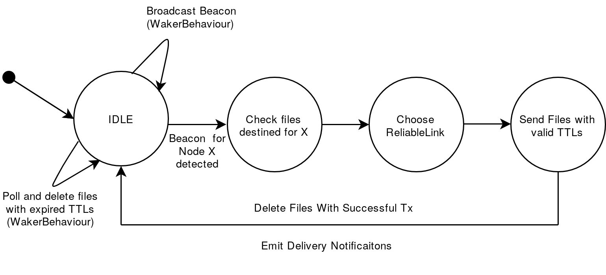

# Delay Tolerant Networks in UNETSTACK
## Design Document
*Arnav Dhamija, 2019*

**Everything in this DD is Work In Progress!**

### Overview

Delay Tolerant Networks (DTNs) are used in a number of applications where conventional communication schemes are inadequate due to erratic network conditions, lack of network infrastructure, or long propagation delays in the communication medium.

In this project, we are attempting to use an adaptation of DTN protocols to improve message delivery in underwater networks using the UNETSTACK software platform. We are developing the protocol to target certain scenarios in which DTNs can have appreciable improvements in the network performance.

### Use Cases

* Robotic SWANs are used for collecting marine data through the use of on-board water probes. These SWANs have multiple network interfaces through which data can be transmitted. However, due to inclement weather conditions, it is also possible that no data gets transmitted at all. DTNs can save the day in this case by relaying critical information through nearby nodes which may have better network access. Thanks to the Store-Carry-And-Forward (SCAF) of DTNs, a SWAN can also wait until network conditions improve to send data.
* Underwater networks can consist of static sensors and an AUV for relaying the data from the sensor. Due to battery limitations, these sensors have constraints on the number of times they can transmit information to an AUV. A protocol which enables the sensor to only send data when it has detected an AUV relay is nearby can help in saving power. The Advertising feature characteristic of some ad-hoc DTNs can help here by having a Beacon broadcasting node information to other nodes over a low-power link.
* Maybe STARFISH swarm robots? DTNs could be used to help in disseminating information in swarms.

### Initial Goals

We are relaxing some of the requirements for DTNs for the first iteration of this project. Some of the current goals for the initial design include the implementation of:

* Beacons, to allow nodes to advertise their existence and find other nodes.
* A storage mechanism to allow for SCAF. This should also delete files which have been successfully acknowledged or those which have expired TTLs.
* A PDU (which will be wrapped in the DatagramReq) for storing DTN metadata such as TTL.
* A DTNAgent which can handle Datagram requests from other agents and send essential notifications about the relay of PDUs. The DTNAgent should be able to talk over multiple ReliableLinks and should have a mechanism of choosing the best Link for a certain application.

Goals which will not be covered by the first iteration but which may be covered in the future are:

* Multihop routing of PDUs.
* Dynamic routing protocols.
* Fragmentation and reassembly of large PDUs.
* Multiple copies of PDUs.
* Optimally ordering/prioritizing PDUs for relays between nodes.

### Flowchart



### Classes

#### DtnBeacon

The Beacon is a part of the DTNAgent. Its task is to periodically send a message to advertise the existence of a node to all neighbors by sending a BeaconReq with the Recipient set to the DTNAgent.

The BeaconReq should also some way of informing other nodes about which ReliableLinks are available on the node. Neighboring nodes can use this information to decide the best Link to send a DatagramReq on.

```
class DtnBeacon {
    int duration;
    TickerBehavior tb;

    DtnBeacon(DtnAgent agent, int duration) {
        tb = add new TickerBehavior(agent, duration, {
            send new BeaconReq(recipient: agent.getAgentID(), channel: Physical.CONTROL));
        }
    }

    void stopBroadcasting() {
        tb.stop();
    }

    // FIXME: Find a way to broadcast information about the ReliableLinks available on the node

    // setters and getters for other things
};
```

#### DtnPDU

The PDU will hold the data to be transmitted along with the DTN metadata. For now, we just need to keep the TTL along with the data.

Here, the TTL represents the number of seconds left before the PDU expires. Once the PDU has expired, we delete it from persistent storage.

The ID is a nonce for uniquely identifying each PDU for tracking purposes. It is generated on the node which creates the PDU.

```
class DtnPDU extends PDU {
    void format() {
        length(512);
        uint32("id");
        uint32("ttl");
        char("data", 504);
        padding(0xff); // can be removed
    }
};
```

#### DtnStorage

The DtnStorage class will handle the SCAF mechanism. It will track PDUs, manage storage on the node and will delete expired PDUs.

Each PDU contains a TTL which specifies the time until its expiry. DtnStorage can implement this by having an Sqlite3 database with three columns: PDU ID (Primary Key), Next Hop, Arrival Time, and TTL of the PDU. This database will be stored on the persistent storage.

Alternatively, we can use a HashMap key-value pair, with the key being the PDU ID and the value being a Set of the Next Hop, Arrival Time, and TTL of the PDU *at* the time of arrival.

The PDUs themselves will be serialized to JSON for storage on the node using the [Gson](https://github.com/google/gson) library. The filename of this JSON will be the PDU ID. This will make it easier to manage the files with relation to the database entries.

When the DtnAgent finds a new node, it will query the database/data structure for the PDUs destined for the node. Once this is done, the TTLs are checked for expiry. If the PDU is still alive, the PDU's TTL will be reduced by (currentTime - arrivalTime). The agent will then send the PDU over one of the ReliableLinks. It will continue to listen for notifications for the delivery status of the PDUs. If the agent is notified of a successful transmission, the entry is deleted from the database/data structure and the corresponding JSON file is deleted along with it. If the agent receives a notification about delivery failure or it doesn't  notification at all, it will try retransmitting the PDU periodically while 1) the other node is still "visible" 2) the PDU is still alive.

## Open Issues

* Should no Ntf and failed Ntf be handled the same way?
* When we receive a non-success Ntf, should we switch over to a different link or should we keep retrying on the same link?
* How do we inform the other nodes about the ReliableLinks we have available? Even if an RL exists on the node, it may not actually be operational for sending messages (e.g. two AUVs trying to talk over a WiFi radio underwater). So we need to have some way of testing the Link between the nodes before advertising the Link.
