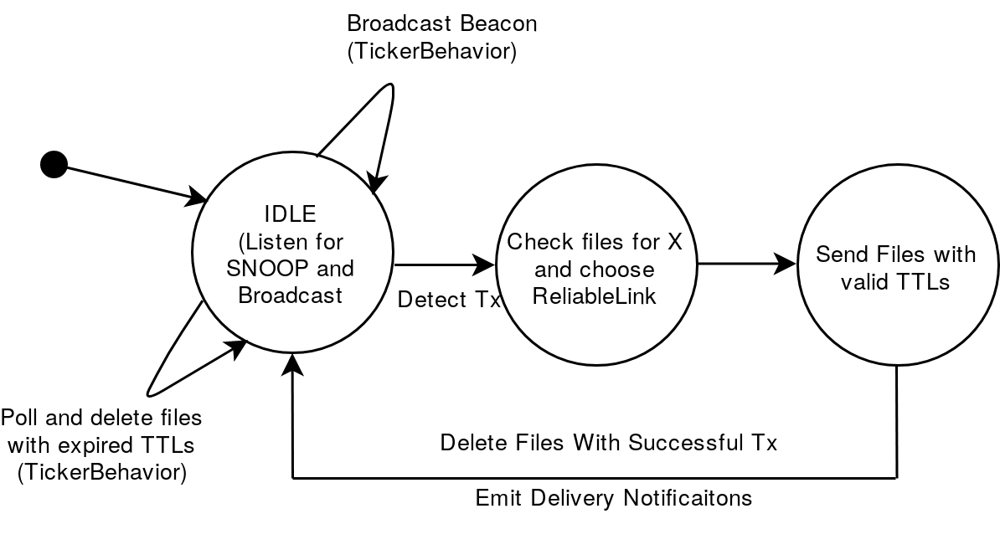

# Delay Tolerant Networks in UNETSTACK
## Design Document
*Arnav Dhamija, 2019*

**Everything here is Work In Progress!**

### Overview

Delay Tolerant Networks (DTNs) are used in a number of applications where conventional communication schemes are inadequate due to erratic network conditions, lack of network infrastructure, or long propagation delays in the communication medium.

In this project, we are attempting to use an adaptation of DTN protocols to improve message delivery in underwater networks using the UNETSTACK software platform. We are developing the protocol to target certain scenarios in which DTNs can have appreciable improvements in the network performance.

### Use Cases

* Robotic SWANs are used for collecting marine data through the use of on-board water probes. These SWANs have multiple network interfaces through which data can be transmitted. However, due to inclement weather conditions, it is also possible that no data gets transmitted at all. DTNs can save the day in this case by relaying critical information through nearby nodes which may have better network access. Thanks to the Store-Carry-And-Forward (SCAF) of DTNs, a SWAN can also wait until network conditions improve to send data.
* Underwater networks can consist of static sensors and an AUV for relaying the data from the sensor. Due to battery limitations, these sensors have constraints on the number of times they can transmit information to an AUV. A protocol which enables the sensor to only send data when it has detected an AUV relay is nearby can help in saving power. The Advertising feature characteristic of some ad-hoc DTNs can help here by having a Beacon broadcasting node information to other nodes over a low-power link.
* Maybe STARFISH swarm robots? DTNs could be used to help in disseminating information in swarms.

### Initial Goals

We are relaxing some of the requirements for DTNs for the first iteration of this project. Some of the current goals for the initial design include the implementation of:

* Beacons to allow nodes to advertise their existence and find other nodes.
* A storage mechanism to allow for SCAF. This should also delete files which have been successfully acknowledged or those which have expired TTLs.
* A PDU (which will be wrapped in the DatagramReq) for storing DTN metadata such as TTL.
* A DTNAgent which can handle Datagram requests from other agents and send essential notifications about the relay of PDUs. The DTNAgent should be able to talk over multiple ReliableLinks and should have a mechanism of choosing the best Link for a certain application.

Goals which will not be covered by the first iteration but which may be covered in the future are:

* Multihop routing of PDUs.
* Dynamic routing protocols.
* Fragmentation and reassembly of large PDUs.
* Multiple copies of PDUs.
* Optimally ordering/prioritizing PDUs for relays between nodes.

### Flowchart

