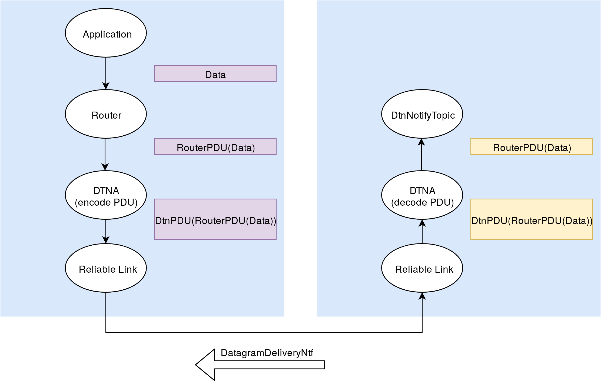

# Disruption Tolerant Networks in UnetStack
## Design Document
*Arnav Dhamija, 2019*

**Everything in this DD is Work In Progress!**

**Code snippets are just for illustration and are a mix of Java/Groovy with pseudocode**

### Overview

Disruption Tolerant Networks (DTNs) are used in a number of applications where conventional communication schemes are inadequate due to erratic network conditions, lack of network infrastructure, or long propagation delays in the communication medium.

In this project, we are attempting to use an adaptation of DTN protocols to improve message delivery in underwater networks using the UnetStack software platform. We are developing the protocol to target certain scenarios in which DTNs can have appreciable improvements in the network performance.

**NOTE: See CompileStatic: http://docs.groovy-lang.org/latest/html/gapi/groovy/transform/CompileStatic.html**

### Use Cases

* Robotic SWANs are used for collecting marine data through the use of on-board water probes. These SWANs have multiple network interfaces through which data can be transmitted. However, due to inclement weather conditions, it is also possible that no data gets transmitted at all. DTNs can save the day in this case by relaying critical information through nearby nodes which may have better network access. Thanks to the Store-Carry-And-Forward (SCAF) mechanism of DTNs, a SWAN can also wait until network conditions improve to send data.
* Underwater networks can consist of static sensors and an AUV for relaying the data from the sensor. Due to battery limitations, these sensors have constraints on the number of times they can transmit information to an AUV. A protocol which enables the sensor to only send data when it has detected an AUV relay is nearby can help in saving power. From the AUV, the DTN can have the capability to automatically upload the data stored in the AUV's persistent storage to a removable storage device.
* DTNs could be used to help in disseminating information in swarms such as the STARFISH network.

### Initial Goals

We are relaxing some of the requirements for DTNs for the first iteration of this project. Some of the current goals for the initial design include the implementation of:

* A **Beacon**, to allow nodes to advertise their existence and find other nodes.
* A **Storage** mechanism to allow for SCAF. This should also delete files which have been successfully acknowledged or those which have expired TTLs.
* A **PDU** (which will be wrapped in the DatagramReq) for storing DTN metadata such as TTL.
* A **DTNA** (DTN Agent) which can handle Datagram requests from other agents and send essential notifications about the relay of PDUs.

Goals which will not be covered by the first iteration but which may be covered in the future are:

* Dedicated ACK schemes. Though this is very important in DTNs, we are only focussing on single hop routing and we only need to make sure our message has reached the next hop node. This will be covered by using ReliableLinks for single hops.
* The DTNA should be able to talk over multiple ReliableLinks and should have the capability of choosing the best Link for a certain application.
* Multihop routing of PDUs.
* Dynamic routing protocols.
* Fragmentation and reassembly of large PDUs.
* Multiple copies of PDUs.
* Optimally ordering/prioritizing PDUs for relays between nodes.

### Flowchart


### Classes

#### DtnBeacon

The Beacon is a part of the DTNA. Its task is to periodically send a message to advertise the existence of a node to all neighbors by sending an empty DatagramReq with the Recipient set to the DTNA.

Beacons are not explicitly required to advertise the existence of links. The DTNA will snoop for packets sent on all Reliable links connected to it. If we detect a transmission during the beacon interval, then there is no need to send a Beacon on that Link for that interval.

#### DtnPdu

The PDU will hold the data to be transmitted along with the DTN metadata. We need to maintain the TTL and ID along with the data.

Here, the TTL represents the number of seconds left before the PDU expires. Once the PDU has expired, we delete it from persistent storage.

The ID is a nonce for uniquely identifying each PDU for tracking purposes. It is generated on the node which creates the PDU.

```
class DtnPDU extends PDU {
    int pduLength; // FIXME: does this get added to the size of the PDU?

    // do we need these fields?
   // final int DATA_PDU = 0x01;
   // final int SUCCESS_PDU = 0x02;
   // final int FAILURE_PDU = 0x03;

    DtnPDU(int length) {
        pduLength = length;
    }

    void format() {
        length(pduLength);
        uint8("type");
        uint32("id");
        uint32("ttl");
        char("data", pduLength-8);
        padding(0xff); // do we really need padding?
    }
};
```

#### DtnStorage

The DtnStorage class will handle the SCAF mechanism. It will track PDUs, manage storage on the node and will delete expired PDUs.

Each PDU contains a TTL which specifies the time until its expiry. DtnStorage can implement this by having an Sqlite3 database with three columns: PDU ID (Primary Key), Next Hop, and the Expiry Time based on the node's own clock. This database will be stored on the persistent storage.

Alternatively, we can use a HashMap, keyed by the Next Hop node. The value of the key, will have a set of tuples of the PDU ID and Expiry Time. One disadvantage of this approach is that the in-memory DB could be affected by power failure. To fix this, we will back the DB on the filesystem.

The PDUs themselves will be serialized to bytes for storage on the node using the [Gson](https://github.com/google/gson) library. The filename of this JSON will be the PDU ID. This will make it easier to manage the files with relation to the database entries. All the serialized PDUs will be kept in a separate directory on each node.

When the DTNA finds a new node (either through a Beacon or a snooped message), it will query the database/data structure for the PDUs destined for the node. Once this is done, the TTLs are checked for expiry. The agent will then send the PDU over one of the ReliableLinks (RLs).

As we are exclusively using RLs, we are *guaranteed* to get a notification about the result of the delivery. It will continue to listen for notifications for the delivery status of the PDUs. If the agent is notified of a successful transmission, the entry is deleted from the database/data structure and the corresponding PDU file is deleted along with it. If the agent receives a notification about delivery failure, <what will it do?>

**Edge Case:** If the receiving node is out of buffer space, we can lose a message entirely! The receiving node will not be able to store the message due to insufficient buffer space, but the RL will report successful delivery, causing the sending node to delete the message from its buffer. This might be addressed in the future if it becomes a significant problem.

```
// This will also be an inner class of DTNA!
// should this be allowed to make the DatagramReqs or should that be offloaded to the DTNA?
class DtnMsg {
    int nextHop;
    long expiryTime;
    String originalMessageID;
};

class DtnStorage {
    // db is PduID and DtnMsg
    HashMap<long, DtnMsg> db;
    // datagramMap maps the New (resent) DR messageID to PduID
    HashMap<String, long> datagramMap;

    DtnMsg[] getNextHopMsgs(int nextHop) {
        DtnMsg[] msgs;
        for (def msg : db) {
            if (currentTime > msg.expiryTime) {
                deleteMsg(msg.id);
                continue;
            }
            if (msg.nextHop == nextHop) {
                msgs.add(msg);
            }
        }
        return msgs;
    }

    void savePdu(DatagramReq req) {
        def nonce = random(32);
        def pdu = new DtnPDU(req.data, nonce, ttl); // will change syntax
        String s = serializePDU(pdu);
        save(s);
        addDbEntry(nonce, req.get(nextHop), req.getTtl()+currentTime, req.messageID);
    }

    void deleteMsg(int pduId) {
        removeDbEntry(id);
        delete(id);
    }

    int getBufferSpace();

    void addDbEntry(long id, int nextHop, long expiryTime, String originalMessageID);
    void removeDbEntry(long pduId);
    void deleteMsg(long pduId);
    DtnMsg[] deleteExpiredMsgs();
    DtnMsg[] getNextHopMsgs(int nextHop);
    String serializePDU(DtnPDU pdu);
    DtnPDU deserializePDU(String s);
    DtnPDU getPdu(int id);
};
```

#### DTNA

The DTNA is a UnetAgent which contains instances of the above classes. The DTNA will handle the sending of messages, sending and receiving of notifications, and logic for selecting the ReliableLink to be used.

The DTNA will support the Link service. This implicitly means it will have to support the Datagram service as well. However, it will not support the Reliability capability as there is no guarantee that we will receive the notification of a successful delivery. The Agent can only provide delivery notifications on a best effort basis to Datagrams which have Reliability set to null. Datagrams which require Reliability will be refused.

This DTNA will receive Datagrams from the Router. This means the DTNA will not be responsible for routing messages for the time being. It will also receive messages from Reliable links which need to be passed up to the router. The below block diagram illustrates this:



(Yellow == DatagramNtf, Purple == DatagramReq)

For now, we trust the Link to take care of notifications and the resending of payloads. The DTNA will subscribe to these topics to mark PDUs ready for deletion. At the moment, we will only choose to send messages on the first ReliableLink we can find.

**NOTE:** We only advertise success immediately, not failure! This is because a failed message at one instant may succeed later. On a message which has expired, we just send a DFN on DTNA's topic.

**Future work:** If a Datagram cannot be sent on a given link, the Agent will try sending it on the other links until 1) the message is transferred successfully 2) the Beacon message from the receiving node is no longer received 3) all the other options for ReliableLinks have been exhausted. In case 3) it might be beneficial to resend the message at exponentially increasing intervals, or as future work, transfer custody of the message to another node.

```
class DTNA extends UnetAgent {
    // These can inner classes / part of the same pkg
    DtnStorage storage;

    AgentID reliableLink;
    AgentID router;
    AgentID notify;
    AgentID nodeInfo;

    TickerBehavior beacon;
    TickerBehavior sweepStorage;
    int addr;
    long linkLastSeen;
    final int BEACON_DURATION = 100000; // should this be a param?
    final int STORAGE_DURATION = 100000;

    void setup() {
        register Services.LINK
        register Services.DATAGRAM
    }

    void startup() {
        storage = new DtnStorage(this, STORAGE_DURATION);

        // I'm not really sure if this is required
        phy = agentForService Services.PHYSICAL
        nodeInfo = agentForService Services.NODE_INFO
        router = agentForService Services.ROUTING

        subscribe(phy)
        subscribe(topic(phy, Physical.SNOOP))
        notify = topic()

        addr = get(nodeInfo, NodeInfoParam.address)

        // should this be made a function?
        add new OneShotBehavior({
            getReliableLink();
        })

        beacon = add new TickerBehavior(BEACON_DURATION, {
            if (currentTime - linkLastSeen >= BEACON_DURATION) {
                reliableLink << new DatagramReq(channel: Physical.CONTROL, to: Address.BROADCAST)
                linkLastSeen = currentTime;
            }
        })

        sweepStorage =  add new TickerBehavior(STORAGE_DURATION, {
            def deletedDtnMsgs = storage.deleteExpiredMsgs();
            // now we need to send failed ntfs for all the deleted msgs
            for (dtnMsg : deletedPduIDs) {
                // just generate the Ntfs and broadcast them
                notify.send(createNtf(dtnMsg, FAILURE));
            }
        })
    }

    Message createNtf(DtnMsg msg, int result) {
        Message ntf;
        if (result == SUCCESS) {
            ntf = new DatagramDeliveryNtf(to: msg.nextHop, inReplyTo: msg.getMessageID())
        } else if (result == FAILURE) {
            ntf = new DatagramFailureNtf(to: msg.nextHop, inReplyTo: msg.getMessageID())
        }
        return ntf;
    }

    // adapt this to single link
    void getReliableLink() {
        reliableLinks.clear();
        def links = agentsForService(Services.LINK);
        for (def link : links) {
            CapabilityReq req = new CapabilityReq(link, DatagramCapability.RELIABILITY);
            Message rsp = request(req, 500); // this could take a while if we have a lot of links
            if (rsp.getPerformative() == Performative.CONFIRM) {
                // NOTE: need to subscribe to the PHY for each link as well!
                subscribe(link);
                // subscribe(phy-for-this-link)
                reliableLink = link;
                break;
            }
        }
    }

    Message processRequest(Message msg) {
        switch (msg) {
        // FIXME: Need to distinguish DatagramReqs based on the origin
        case DatagramReq:
            if (msg.getReliability() || msg.getTTL() == NaN || storage.bufferFull()) {
                // do we need to create a DFN for this?
                return new Message(msg, Performative.REFUSE);
            } else {
                storage.savePdu(msg);
                return new Message(msg, Performative.AGREE);
            }
            return null;
        }
    }

    int getMTU() {
        return reliableLink.getMTU-8;
    }

    void processMessage(Message msg) {
        switch (msg) {
            // do we need a protocol number
        case RxFrameNtf:
            if (msg.to != addr) {
                // now we know this node is alive!
                // start sending messages residing in the SCAF to it
                def msgs = getMsgsForNextHop(addr);
                for (def msg : msgs) {
                    def bytes = deserializeJSON(msg.id);
                    def data = dtnPdu.decode(bytes);
                    // reduce the TTL
                    data.ttl = msg.expiryTime - currentTime;
                    reliableLink.send(new DatagramReq(to: msg.to, data: pdu.encode(data)));
                }
            }
            break;
        case DatagramNtf:
            // if buffer space is low, then we can't accept a new DGram for SCAF
            // but the Link thinks it has done its job properly!
            // resolve with DTN PDUs?!

            // NOTE: what should we do with other link messages?
            if (msg.getProtocol() == DTN_PROTOCOL) {
                if (getBufferSpace() != LOW) {
                    DtnPDU pdu(reliableLink.getMTU());
                    def pduData = pdu.decode(msg.data);
                    notify << msg;
                } else {
                    notify.send(createMessage(dtnMsg, FAILURE));
                }
            }
            linkLastSeen = currentTime
            break;
        case DatagramDeliveryNtf:
            // how do we get the message to which it is mapped? -> inReplyTo
            // the problem is that we are resending the datagram.
            // so this DDN may not make sense to any subscriber
            def pduId = storage.datagramMap.get(s); // change this to a proper getter
            def dtnMsg = storage.getDtnMsg(pduId);
            storage.deleteMsg(pduId);
            notify.send(createNtf(dtnMsg, SUCCESS));
            break;
        case DatagramFailureNtf:
            // we don't need to do anything,
            // but again, which Dgram/might need to manually map this
            // is it mapped to?
            def pduId = storage.datagramMap.get(s); // change this to a proper getter
            def dtnMsg = storage.getDtnMsg(pduId);
            storage.deleteMsg(pduId);
            notify.send(createNtf(dtnMsg, FAILURE));
            break;
        }
    }
};
```

## Open Issues
* How will multi-hop ntfs be sent?
* What should agents do on listening to the Ntfs and what action should they take?
* OutputPDUs also have a length field which must be filled
* DatagramReq docu: https://unetstack.net/javadoc/org/arl/unet/DatagramReq.html getTTL()
* Compile static invalidates things like 1.second
* Is a TTL'ed message the same as a failed message and worth informing the other node about? Ideally even failed messages should go back up to router?
* How do I run groovy in my IDE?
* Why do DDN's/DFN's have "to:" set to the sending node?
* What is the difference between calling a fxn and using a 1-shot behavior?
* Why would i need fillers in my PDUs?

## Check
* What do we tell the other node when a TTL expires?
* What does PDU.decode return if the bytes we get are not decodeable?
* Do all PDUs take all the available size with padding?
* Can we create DatagramDeliverNtf/FailedNtf when the DatagramReq comes to DTNA? This is going to make tracking messages very intensive!
    * for each DReq
    * we need a new pair of Ntfs
    * <s>and these need to be tracked as in <Initial DReq ID, Resent DReq ID, NewSuccessNtf, NewFailedNtf> </s>
        * We could go with storing <PDU ID, Next-Hop, Expiry Time, DDN, DFN>. On receipt of success/failed PDUs from DTNA, we can send the correct Ntf on our notification topic.
        * Then we won't need to do the messy work of maintaining MessageID, PDU ID
* What do we do once the buffer space is full? What message do we send as a response?
    * The link will say OK, but the DTNA will refuse the message, spurious ACK!!
* Should we retransmit DDNs/DFNs?
* Create a DTN protocol type for DatagramReqs which are meant for me!!
* How do I get the last sent message time on a link?
    * just subscribe to it
* Do we need to broadcast on our own topic? - YES!!
* Do we need to serialize PDUs as JSON? Can't we just store the bytes of the PDU?
* Should DeliveryNtfs be broadcast on a topic? - yes!
* What do we do once we receive a DatagramNtf? Do we send it over to router or store it in SCAF? Will Router pass the message up to the App?
    * atm we are bundling it in a DatagramReq and sending it off to Router
* How can I print messages in the shell? - just the shell a message
* Do we need a success PDU when we get link layer results? - maybe?!

## Resolved
* why does unetstack rename all the old files?
* Don't send beacon unless you get an AGREE from the layer
* How do I get/set params for an Agent?
    * create a new enum file and add the properties there for further usage 
* how do I subscribe to DDN/DFNs?
    * they are getting sent to shell, but not to my agent for some reason
* DatagramFailedNtf/DatagramDeliveryNtf does not give me information about which DatagramReq it is in response to
* Should Beacons be sent to a topic or sent to a Broadcast Address instead?
* How does Router know whether a DatagramReq has the Router headers or not? We need to do the same thing for DTNAgent
* How do we differentiate between a message sent to DtnAgent from Link and from Router? A message coming from Router won't have the PDU fields. Maybe we could use getRecipient field to discriminate between these two cases?
    * Where are the TTLs being decided? Does the Router add the TTLs to the DatagramReq before it sends it to DtnAgent? Or will the DtnAgent fill in the TTLs
* Do we need a DtnReq/Ntf pair?
* Should no Ntf and failed Ntf for delivery of a Datagram be handled the same way?
* When we receive a failed Ntf for delivery, should we switch over to a different link or should we keep retrying on the same link?
* How do we inform the other nodes about the ReliableLinks we have available? Even if an RL exists on the node, it may not actually be operational for sending messages (e.g. two AUVs trying to talk over a WiFi radio underwater). So we need to have some way of testing the Link between the nodes before advertising the Link.
* Lost Beacon / disconnection mechanism?

// Dhananjai's project: Implemented two reactive routing protocols and a non-persistent method-based CSMA MAC protocol for a small shallow-water ad hoc network on UnetStack.

Created an underwater network-based version of a mobile ad hoc network-based routing scheme called Ad-hoc On-demand Distance Vector Routing.

Compared the routing protocols by analyzing the effect of varying offered load, network size and the number of route-discovery re-transmissions on packet delivery ratio and control overhead